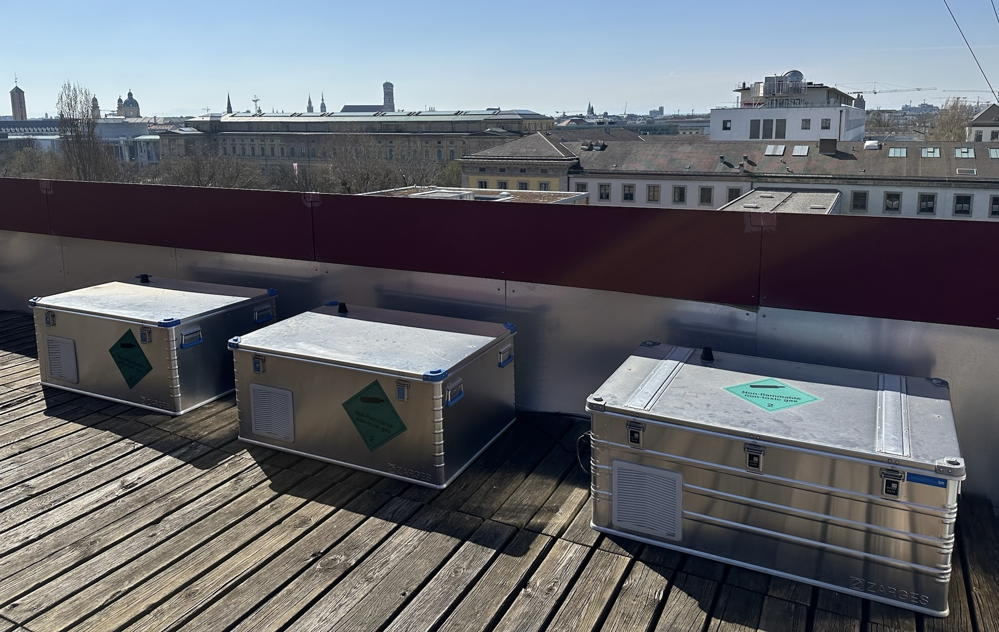
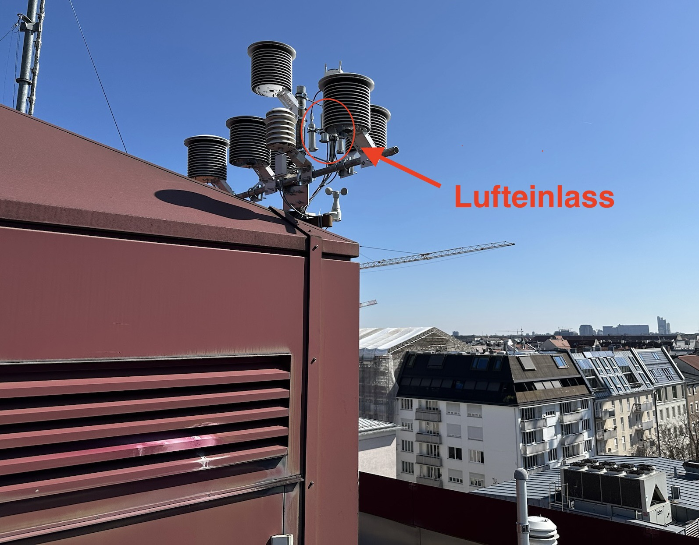

# HES-2-Praktikum

## Messstation TUM N5 Dach

In diesem Praktikum arbeitet ihr mit realen Messdaten, die auf dem Dach des Gebäudes N5 an der Technischen Universität München aufgenommen wurden. Die verwendeten Sensoren befinden sich in wettergeschützten und temperaturstabilisierten Außenboxen. Dabei wird Luft über einen Schlauch von einem externen Lufteinlass kontinuierlich in das Messsystem gepumpt.




## Lernziele

Verarbeitung von in-situ $CO_2$-Sensordaten:

- Kalibrationskorrektur (**Calibration Correction**)
- Zeitliche Aggregation und Qualitätsmetriken (**Time Aggregation & Performance Metrics**)
- Sensitivitätsanalyse der $CO_2$-Sensoren (**Sensor Sensitivity**)
- (Bonus Notebook) Korrektur der Messwerte von feuchter auf trockene Luft (**Dilution Correction**)

## Vorbereitung zumn Praktikum

1.	Grundlagen verstehen

Bitte schaue dir zur Vorbereitung die beiden verlinkten Videos über das [Ideal Gas Law](https://youtu.be/BxUS1K7xu30?si=f3rDpXa9sT9PRdz9) sowie den [Partialdruck](https://youtu.be/JbqtqCunYzA?si=UgNx84xJpQUcYKGu) an, um die theoretischen Grundlagen zu vertiefen. Bei Bedarf können in beiden Videos deutsche Untertitel aktiviert werden.

2.	Technische Vorbereitung (optional)

Falls du mit deinem eigenen Laptop arbeiten möchtest, klone bitte im Vorfeld das bereitgestellte Repository, richte die virtuelle Python-Umgebung ein und installiere die erforderlichen Libraries.

#### **Voraussetzungen**

- [Installiere VS Code](https://code.visualstudio.com/Download) + [Extension für Jupyter](https://www.youtube.com/watch?v=suAkMeWJ1yE)
- Python **3.13 or later**
- Poetry (`pip install poetry`)
- Deaktiviere Github Co-Pilot und weitere Tools mit automatischer Code Vervollständigung

#### **Einrichtung Virtuelle Umgebung + Installation Libraries**

MacOS/Linux:

```bash
python3.13 -m venv .venv  # Create virtual environment
source .venv/bin/activate  # Activate it
poetry install  # Install dependencies
```

Windows:

```bash
py -3.13 -m venv .venv  # Create virtual environment
Set-ExecutionPolicy -ExecutionPolicy RemoteSigned -Scope Process  # Allow script execution
.venv\Scripts\Activate.ps1  # Activate it
poetry install  # Install dependencies
```